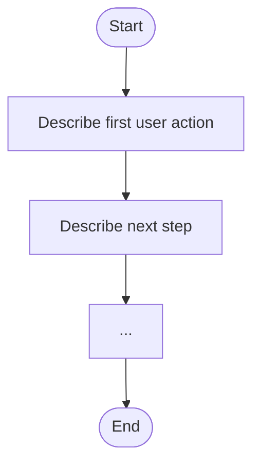
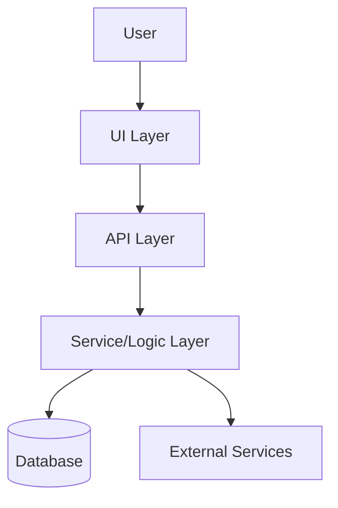

# Product Requirements Document (PRD)

> **Instructions:**  
> This template is AI-optimized and must be filled out with both human and AI assistant clarity in mind.  
> Reference all relevant framework documents (see checklist below) and use Mermaid diagrams for all flows.  
> For each requirement, specify related guideline docs and assign clear ownership.

## Framework Reference Checklist
- [ ] Reference to `knowledge.md` for architecture/decisions
- [ ] Reference to `plan.md` for TDD test mapping
- [ ] Reference to `todo.md` for task breakdown
- [ ] Reference to `step_plan.md` for implementation steps
- [ ] Reference to `ai-ide-instructions.md` for AI coding standards
- [ ] Reference to role guidelines (programmer, designer, tester)
- [ ] Reference to this PRD in plan.md and todo.md

## 1. Background & Problem Statement

- **Why is this project/feature needed?**
- **What problem does it solve?**
- **Who are the stakeholders?**

---

## 2. Goals & Success Criteria

- **What are the primary objectives?**
- **How will success be measured?**
- List clear, measurable acceptance criteria (≤10 items).

---

## 3. Feature Overview

- **High-level summary of the feature(s) or product.**
- **Key user stories or scenarios.**

---

## 4. Functional Requirements

| # | Requirement | Priority | Acceptance Criteria | Related Docs |
|---|-------------|----------|--------------------|--------------|
| 1 |             | High     |                    |              |
| 2 |             | Medium   |                    |              |
| 3 |             | Low      |                    |              |

---

## 5. Non-Functional Requirements

- **Performance:** (e.g., response time, throughput)
- **Security:** (e.g., data protection, compliance)
- **Scalability:** (e.g., expected load, growth)
- **Accessibility:** (e.g., WCAG compliance)
- **Other:** (e.g., localization, cross-platform)

---

## 6. User Flow (Mermaid Diagram)

---

## 7. System/Architecture Flow (Mermaid Diagram)

---

## 8. UI/UX Requirements

- **Design references:** (link to Figma/Sketch/Adobe XD, etc.)
- **Component requirements:** (reference atomic/component specs)
- **Accessibility notes:** (keyboard navigation, ARIA, etc.)

---

## 9. Testing & Verification Plan

- **Test scenarios:** (list key tests, edge cases)
- **Performance tests:** (describe load/performance requirements)
- **Accessibility tests:** (describe a11y validation)
- **AI-assisted test points:** (where AI should help generate/validate tests)

---

## 10. Dependencies & Risks

- **Dependencies:** (other teams, services, libraries)
- **Risks:** (potential blockers, mitigation strategies)
- **AI integration points:** (where AI will assist in implementation, testing, or documentation)

---

## 11. Milestones & Timeline

| Milestone | Owner | Due Date | Status |
|-----------|-------|----------|--------|
|           |       |          |        |
|           |       |          |        |

---

## 12. Related Documents & References

- [ ] Link to original idea/requirement in `ideas/`
- [ ] Reference to `knowledge.md` for architectural decisions
- [ ] Reference to `plan.md` for TDD test roadmap
- [ ] Reference to `todo.md` for task tracking
- [ ] Reference to `step_plan.md` for implementation steps
- [ ] Reference to `ai-ide-instructions.md` for AI coding standards
- [ ] Reference to role guidelines as needed

---

## 13. Appendix

- **Additional notes, diagrams, or clarifications.**
- **Glossary of terms (if needed).**

---